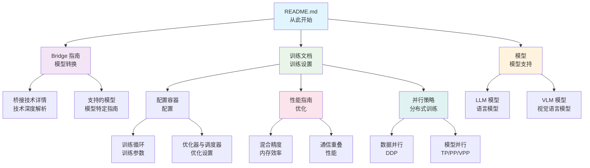

# Megatron Bridge 文档

欢迎来到 Megatron Bridge 文档！本指南将帮助您浏览我们的全面文档，以找到训练、转换和使用大语言模型及视觉语言模型所需的确切信息。

## 🚀 快速入门路径

### 我想要

**🏃‍♂️ 开始模型转换**
→ 从 [Bridge 指南](bridge-guide.md) 开始，了解 Hugging Face ↔ Megatron 转换

**⚡ 理解并行策略与性能**
→ 跳转到 [并行策略指南](parallelisms.md) 和 [性能指南](performance-guide.md)

**🚀 开始训练模型**
→ 查看 [训练文档](training/README.md) 获取全面的训练指南

**📚 查找模型文档**
→ 浏览 [支持的模型](models/llm/index.md) 以了解 LLM，或 [视觉语言模型](models/vlm/index.md) 以了解 VLM

**🔧 从 NeMo 2 或 Megatron-LM 迁移**
→ 查看 [NeMo 2 迁移指南](nemo2-migration-guide.md) 或 [Megatron-LM 迁移指南](megatron-lm-to-megatron-bridge.md)

**📊 使用训练配方**
→ 阅读 [配方使用](recipe-usage.md) 了解预配置的训练配方

**🔌 添加对新模型的支持**
→ 参考 [添加新模型](adding-new-models.md)

**📋 检查版本信息**
→ 查看 [发布文档](releases/README.md) 了解版本、变更日志和已知问题

---

## 👥 按角色划分的文档

### 面向机器学习工程师与研究员

- **从这里开始:** [Bridge 指南](bridge-guide.md) → [训练文档](training/README.md)
- **深入探究:** [性能指南](performance-guide.md) → [训练优化指南](training/README.md#optimization-and-performance)
- **模型支持:** [支持的模型](models/llm/index.md) → [添加新模型](adding-new-models.md)

### 面向训练工程师

- **从这里开始:** [训练文档](training/README.md) → [配置容器概述](training/config-container-overview.md)
- **性能:** [性能指南](performance-guide.md) → [性能摘要](performance-summary.md)
- **并行策略:** [并行策略指南](parallelisms.md) → [训练优化](training/README.md#optimization-and-performance)

### 面向模型开发者

- **从这里开始:** [Bridge 指南](bridge-guide.md) → [Bridge 技术细节](bridge-tech-details.md)
- **模型支持:** [添加新模型](adding-new-models.md) → [模型文档](models/llm/index.md)
- **集成:** [Bridge RL 集成](bridge-rl-integration.md)

### 面向 DevOps 与平台团队

- **从这里开始:** [发布文档](releases/README.md) → [软件版本](releases/software-versions.md)
- **故障排除:** [已知问题](releases/known-issues.md)
- **API 参考:** [API 文档](apidocs/index.rst)

---

## 📚 完整文档索引

### 入门指南

| 文档 | 目的 | 何时阅读 |
|----------|---------|--------------|
| **[Bridge 指南](bridge-guide.md)** | Hugging Face ↔ Megatron 转换指南 | 首次转换模型时 |
| **[Bridge 技术细节](bridge-tech-details.md)** | Bridge 系统的技术细节 | 理解 Bridge 内部原理时 |
| **[并行策略指南](parallelisms.md)** | 数据并行和模型并行策略 | 设置分布式训练时 |
| **[性能摘要](performance-summary.md)** | 快速性能参考 | 快速查找性能信息时 |
| **[性能指南](performance-guide.md)** | 全面的性能优化指南 | 优化训练性能时 |

### 模型支持

| 文档 | 目的 | 何时阅读 |
|----------|---------|--------------|
| **[大语言模型](models/llm/index.md)** | LLM 模型文档 | 使用 LLM 模型时 |
| **[视觉语言模型](models/vlm/index.md)** | VLM 模型文档 | 使用 VLM 模型时 |
| **[添加新模型](adding-new-models.md)** | 添加模型支持指南 | 扩展模型支持时 |

### 训练与定制

| 文档 | 目的 | 何时阅读 |
|----------|---------|--------------|
| **[训练文档](training/README.md)** | 全面的训练指南 | 设置和定制训练时 |
| **[配置容器概述](training/config-container-overview.md)** | 中心化训练配置 | 理解训练配置时 |
| **[入口点](training/entry-points.md)** | 训练入口点与执行 | 理解训练流程时 |
| **[训练循环设置](training/training-loop-settings.md)** | 训练循环参数 | 配置训练参数时 |
| **[优化器与调度器](training/optimizer-scheduler.md)** | 优化配置 | 设置优化器时 |
| **[混合精度](training/mixed-precision.md)** | 混合精度训练 | 减少内存使用时 |
| **[PEFT](training/peft.md)** | 参数高效微调 | 资源有限时进行微调 |
| **[检查点](training/checkpointing.md)** | 检查点管理 | 保存和恢复训练时 |

| **[日志记录](training/logging.md)** | 日志记录与监控 | 监控训练进度 |
| **[性能剖析](training/profiling.md)** | 性能剖析 | 识别性能瓶颈 |

### 配方与工作流

| 文档 | 目的 | 何时阅读 |
|----------|---------|--------------|
| **[配方使用](recipe-usage.md)** | 使用预配置的训练配方 | 快速设置训练 |
| **[Bridge RL 集成](bridge-rl-integration.md)** | 强化学习集成 | RL 训练工作流 |

### 迁移指南

| 文档 | 目的 | 何时阅读 |
|----------|---------|--------------|
| **[NeMo 2 迁移指南](nemo2-migration-guide.md)** | 从 NeMo 2 迁移 | 从 NeMo 2 升级时 |
| **[Megatron-LM 迁移指南](megatron-lm-to-megatron-bridge.md)** | 从 Megatron-LM 迁移 | 从 Megatron-LM 升级时 |

### 参考

| 文档 | 目的 | 何时阅读 |
|----------|---------|--------------|
| **[API 文档](apidocs/index.rst)** | 完整的 API 参考 | 构建集成时 |
| **[发布文档](releases/README.md)** | 版本历史与已知问题 | 检查版本、故障排除时 |
| **[文档指南](documentation.md)** | 贡献文档 | 贡献文档时 |

---

## 🗺️ 常见阅读路径

### 🆕 首次用户

1. [Bridge 指南](bridge-guide.md) *(10 分钟 - 理解转换)*
2. [并行化指南](parallelisms.md) *(15 分钟 - 理解分布式训练)*
3. [训练文档](training/README.md) *(选择您的训练路径)*
4. [配方使用](recipe-usage.md) *(5 分钟 - 使用预配置配方)*

### 🔧 设置训练

1. [训练文档](training/README.md) *(训练系统概述)*
2. [配置容器概述](training/config-container-overview.md) *(理解配置)*
3. [入口点](training/entry-points.md) *(训练如何启动)*
4. [训练循环设置](training/training-loop-settings.md) *(配置参数)*
5. [日志记录](training/logging.md) *(设置监控)*

### ⚡ 性能优化

1. [性能指南](performance-guide.md) *(全面的优化策略)*
2. [性能摘要](performance-summary.md) *(快速参考)*
3. [混合精度](training/mixed-precision.md) *(减少内存使用)*
4. [通信重叠](training/communication-overlap.md) *(优化分布式训练)*
5. [激活重计算](training/activation-recomputation.md) *(减少内存占用)*
6. [性能剖析](training/profiling.md) *(识别瓶颈)*

### 🔄 模型转换工作流

1. [Bridge 指南](bridge-guide.md) *(转换基础)*
2. [Bridge 技术细节](bridge-tech-details.md) *(技术细节)*
3. [支持的模型](models/llm/index.md) 或 [视觉语言模型](models/vlm/index.md) *(模型特定指南)*
4. [添加新模型](adding-new-models.md) *(扩展支持)*

### 🔧 自定义与扩展

1. [训练文档](training/README.md) *(训练自定义)*
2. [PEFT](training/peft.md) *(参数高效微调)*
3. [蒸馏](training/distillation.md) *(知识蒸馏)*
4. [添加新模型](adding-new-models.md) *(添加模型支持)*
5. [Bridge RL 集成](bridge-rl-integration.md) *(RL 工作流)*

### 📦 迁移路径

1. [NeMo 2 迁移指南](nemo2-migration-guide.md) *(从 NeMo 2 迁移)*
2. [Megatron-LM 迁移指南](megatron-lm-to-megatron-bridge.md) *(从 Megatron-LM 迁移)*
3. [训练文档](training/README.md) *(新的训练系统)*

---

## 📁 目录结构

### 主要文档

- **指南** - 并行化、性能、配方和迁移的核心指南
- **Bridge 文档** - Hugging Face ↔ Megatron 转换指南
- **模型文档** - 支持的模型系列和架构

### 子目录

#### [models/](models/README.md)

- **[llm/](models/llm/README.md)** - 大语言模型文档
  - 单个模型指南（Qwen、LLaMA、Mistral 等）
  - 转换示例和训练配方
- **[vlm/](models/vlm/README.md)** - 视觉语言模型文档
  - VLM 模型指南（Qwen VL、Gemma VL 等）
  - 多模态模型支持

#### [training/](training/README.md)

- **配置** - ConfigContainer、入口点、训练循环设置
- **优化** - 优化器、调度器、混合精度、通信重叠
- **性能** - 注意力优化、激活重计算、CPU 卸载
- **监控** - 日志记录、性能剖析、检查点、弹性恢复
- **高级** - PEFT、打包序列、蒸馏

#### [releases/](releases/README.md)

- **软件版本** - 当前版本和依赖项
- **更新日志** - 发布历史和变更
- **已知问题** - 错误、限制和解决方法

---

## 🔗 文档如何连接

---

## 🤝 获取帮助

- **GitHub Issues:** [报告错误或请求功能](https://github.com/NVIDIA-NeMo/Megatron-Bridge/issues)
- **文档问题:** 发现不清楚的地方？请告诉我们！
- **社区:** 加入讨论并分享经验

---

## 📖 额外资源

- **[示例](https://github.com/NVIDIA-NeMo/Megatron-Bridge/tree/main/examples)** - 代码示例和教程
- **[贡献指南](https://github.com/NVIDIA-NeMo/Megatron-Bridge/blob/main/CONTRIBUTING.md)** - 如何为项目做贡献
- **[API 文档](apidocs/index.rst)** - 完整的 API 参考

---

**准备好开始了吗？** 选择上方的路径，或深入阅读[桥接指南](bridge-guide.md)以了解模型转换！🚀