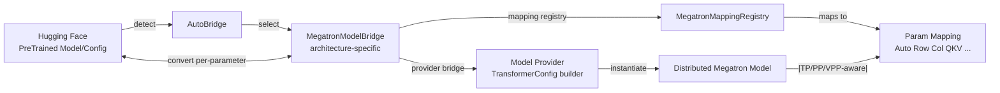
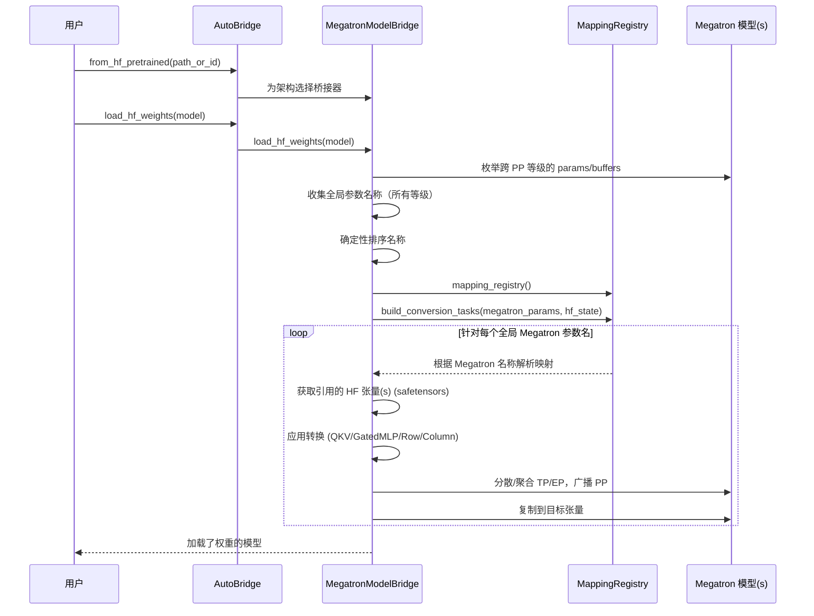
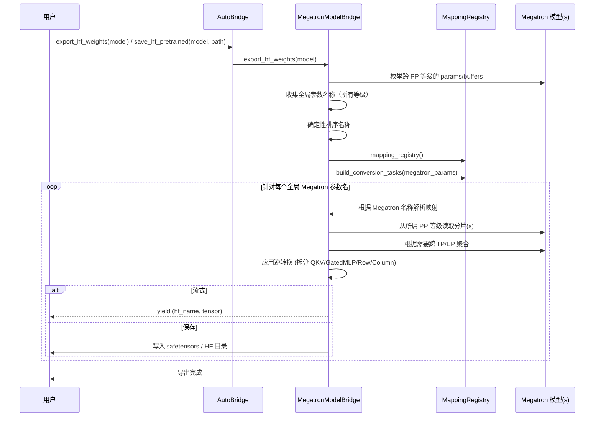

# Megatron Bridge 转换技术细节

Megatron Bridge 提供了一个健壮的、支持并行感知的途径，用于在 🤗 Hugging Face Transformers 和 Megatron-Core 格式之间转换模型和检查点。本页深入探讨其架构、数据流和逐参数转换引擎，并提供示例。

Megatron Bridge 执行的是即时、模型并行感知的逐参数转换——这与需要单个 GPU 并完全在内存中加载 Megatron-Core 和 HF 模型两种模型的传统转换器不同。

- 关于以 API 为中心的用法，请参阅指南：[与 🤗 Hugging Face 的 Bridge](./bridge-guide.md)

## 架构概览



关键组件：

- AutoBridge：检测 HF 架构，构建相应的桥接器，暴露高级的转换/保存 API。参见 {doc}`apidocs/bridge/bridge.models.conversion.auto_bridge`。
- MegatronModelBridge：编排转换，构建转换任务，处理逐参数流式传输。参见 [model_bridge.py](https://github.com/NVIDIA-NeMo/Megatron-Bridge/tree/main/src/megatron/bridge/models/conversion/model_bridge.py)。
- MegatronMappingRegistry：参数名称映射的注册表；为每个权重解析具体的 `MegatronParamMapping`。参见 [mapping_registry.py](https://github.com/NVIDIA-NeMo/Megatron-Bridge/tree/main/src/megatron/bridge/models/conversion/mapping_registry.py)。
- 参数映射：实现参数转换和并行分布（Auto、ColumnParallel、RowParallel、QKV、GatedMLP、Replicated、自定义）。参见 [param_mapping.py](https://github.com/NVIDIA-NeMo/Megatron-Bridge/tree/main/src/megatron/bridge/models/conversion/param_mapping.py)。
- 模型提供者：为 Megatron-Core 构建兼容 `TransformerConfig` 的提供者，并实例化分布式模型。参见 [models/](https://github.com/NVIDIA-NeMo/Megatron-Bridge/tree/main/src/megatron/bridge/models)。
- 特定模型桥接器定义：特定于架构的桥接器位于其模型文件夹下，例如 [LlamaBridge](https://github.com/NVIDIA-NeMo/Megatron-Bridge/tree/main/src/megatron/bridge/models/llama/llama_bridge.py) 和 [Qwen3Bridge](https://github.com/NVIDIA-NeMo/Megatron-Bridge/tree/main/src/megatron/bridge/models/qwen/qwen3_bridge.py)。

## 转换工作流

转换引擎由两部分驱动：特定于架构的 Megatron 模型桥接器和参数映射。

(1) 配置映射 + 模型创建：您指定一个配置映射和参数映射策略（名称模式 + 映射类型）。桥接器加载 HF 配置，将其转换为 Megatron 提供者，然后该提供者实例化一个（可能是分布式的）Megatron 模型。启用 TP/PP/EP 时，每个 rank 仅持有模型的一个分片。

```python
from megatron.bridge import AutoBridge

# 构建桥接器并实例化 Megatron 模型
bridge = AutoBridge.from_hf_pretrained("meta-llama/Llama-3.2-1B")
provider = bridge.to_megatron_provider()
provider.finalize()
megatron_model = provider.provide_distributed_model(wrap_with_ddp=False)
```

(2) 收集所有参数：模型创建后，桥接器枚举所有 PP rank 上的命名参数和缓冲区。然后对它们进行排序以产生确定性的全局顺序，确保每个 rank 在转换期间为集体操作使用相同的映射顺序。

(3) 解析映射：使用全局的 Megatron 参数名称，桥接器查询映射注册表以解析每个参数的具体映射。例如，在 Qwen3 中，`decoder.layers.0.self_attention.linear_qkv.weight` 匹配一个 `QKVMapping` 模式。解析总是从 Megatron 名称开始；HF 名称通过通配符替换派生。只有被引用的 HF 张量会从 safetensors 中获取——完整的 HF 模型永远不会被完全加载。

```python
from megatron.bridge.models.conversion.mapping_registry import MegatronMappingRegistry
from megatron.bridge.models.conversion.param_mapping import AutoMapping, QKVMapping

registry = MegatronMappingRegistry(
    AutoMapping(
        megatron_param="decoder.layers.*.mlp.linear_fc2.weight",
        hf_param="model.layers.*.mlp.down_proj.weight",
    ),
    QKVMapping(
        megatron_param="decoder.layers.*.self_attention.linear_qkv.weight",
        q="model.layers.*.self_attn.q_proj.weight",
        k="model.layers.*.self_attn.k_proj.weight",
        v="model.layers.*.self_attn.v_proj.weight",
    ),
)
# 示例："decoder.layers.0.self_attention.linear_qkv.weight" → QKVMapping
```

(4) 创建转换任务：桥接器将每个 Megatron 参数与其解析出的映射关系以及关联的元数据（所属模块、张量句柄、并行上下文）配对。这些按参数划分的任务成为转换的工作单元。

(5) 执行转换：对于 HF→Megatron 或 Megatron→HF，桥接器遍历任务并调用映射关系的 `hf_to_megatron` 或 `megatron_to_hf` 例程。转换按参数流式进行，以最小化内存占用。

```python
# HF → Megatron 流式导入（内部迭代转换任务）
bridge.load_hf_weights(megatron_model)
```

(6) 映射语义：每个映射关系处理必要的分布逻辑——跨 PP 广播、跨 TP/EP 分散/聚合——并应用结构转换（例如，QKV 融合/拆分、门控 MLP 连接/拆分、行/列并行拆分）。

特性：

- 按参数流式处理：只有当前正在处理的权重保留在内存中。
- 并行感知：分布逻辑尊重 TP（张量）、PP（管道）、VPP（虚拟管道）和专家并行设置。
- 确定性映射：名称通过 `MegatronMappingRegistry` 解析，支持通配符。

### HF → Megatron (导入)



### Megatron → HF (导出)



## 参数映射与并行

可通过 [param_mapping.py](https://github.com/NVIDIA-NeMo/Megatron-Bridge/tree/main/src/megatron/bridge/models/conversion/param_mapping.py) 获得的映射类型：

- AutoMapping：通用的 1:1 参数映射，具有自动 TP 类型检测功能；根据层/模块类型（支持通配符）分派到 ColumnParallelMapping、RowParallelMapping 或 ReplicatedMapping。在适用时参与 PP 广播和 EP 聚合。
- ColumnParallelMapping：在 TP 下沿输出维度（维度 0）拆分。在适用时参与 PP 广播和 EP 聚合。
- RowParallelMapping：在 TP 下沿输入维度（维度 1）拆分。在适用时参与 PP 广播和 EP 聚合。
- QKVMapping：将 HF 的 Q、K、V 投影融合/拆分为 Megatron 的交错 QKV 格式，反之亦然。根据需要使用 PP 广播，并将 TP 委托给底层映射。
- GatedMLPMapping：连接/拆分门控和上投影。在适用时参与 PP 广播和 EP 聚合。
- ReplicatedMapping：保持参数在 TP 等级间完全复制（例如，LayerNorm）。在适用时参与 PP 广播和 EP 聚合。

注意：如果您需要一个 QKVMapping 或 GatedMLPMapping 未涵盖的一对多或多对一映射，请实现自定义映射。

### 映射示例 - ColumnParallelMapping：PP、TP、EP 实践

- HF → Megatron (导入)：
  - HF 张量对所有等级都可用；TP 等级 0 读取完整张量并执行拆分/分散。
  - TP：等级 0 沿维度 0 拆分为 `tp_size` 个块，并将分片分散到 TP 等级，使每个等级接收到的张量与其本地参数形状/数据类型/设备匹配。
  - PP：不需要 PP 集合通信；所属 PP 阶段直接写入其分片。

- EP：对于专家参数，每个 EP 等级通过名称接收其本地专家；导入时不需要跨 EP 的集合通信。

- Megatron → HF（导出）：
  - 最初只有所属的 PP 阶段持有本地的 Megatron 分片；在 TP 收集之前，它会广播给所有 PP 等级。
  - PP：所属的 PP 阶段首先将张量广播给所有 PP 等级，以便每个等级都参与集合通信。
  - TP：所有 TP 分片被收集并沿维度 0 拼接，以重建完整的张量。
  - EP：对于专家参数，分片在 EP 等级间收集，并为每个专家发出一个具有正确名称的 HF 张量。
    - 设总专家数为 E，EP 大小为 S（假设 E % S == 0）。每个 EP 等级拥有 E/S 个专家。对于每个 EP 等级上的给定本地专家索引 L，全局专家 ID 为 L, L+E/S, ..., L+(S-1)*E/S。我们从所有 EP 等级收集张量，并通过将该 ID 替换到 HF 参数名称中，为每个全局专家 ID 发出一个 HF 张量。

这反映了 [param_mapping.py](https://github.com/NVIDIA-NeMo/Megatron-Bridge/tree/main/src/megatron/bridge/models/conversion/param_mapping.py) 中的 [ColumnParallelMapping.hf_to_megatron](https://github.com/NVIDIA-NeMo/Megatron-Bridge/tree/main/src/megatron/bridge/models/conversion/param_mapping.py) 和 [ColumnParallelMapping.megatron_to_hf](https://github.com/NVIDIA-NeMo/Megatron-Bridge/tree/main/src/megatron/bridge/models/conversion/param_mapping.py)。

实现说明（来自代码）：
- 数据类型处理：当 HF 和 Megatron 的数据类型不同时，权重会在 TP 分散之前转换为 Megatron 参数的数据类型，并发出警告（参见 [param_mapping.py](https://github.com/NVIDIA-NeMo/Megatron-Bridge/tree/main/src/megatron/bridge/models/conversion/param_mapping.py) 中的 ColumnParallelMapping.hf_to_megatron）。
- FP8 导出：使用 FP8 张量类时，张量在导出时会被反量化（参见 [param_mapping.py](https://github.com/NVIDIA-NeMo/Megatron-Bridge/tree/main/src/megatron/bridge/models/conversion/param_mapping.py) 中的 `maybe_dequantize`）。
- MoE 专家：专家参数名称被规范化以便查找，专家分片在 EP 等级间收集，并按全局专家 ID 重新发出（参见 [param_mapping.py](https://github.com/NVIDIA-NeMo/Megatron-Bridge/tree/main/src/megatron/bridge/models/conversion/param_mapping.py) 中的 `gather_from_ep_ranks`）。

## 特定架构的桥接示例：Qwen3

嵌入自 `src/megatron/bridge/models/qwen/qwen3_bridge.py`：

```{literalinclude} ../src/megatron/bridge/models/qwen/qwen3_bridge.py
:language: python
:pyobject: Qwen3Bridge
:linenos:
```

说明：

- `provider_bridge`：将 HF 配置转换为与 Megatron 兼容的提供者，包括架构特性（例如，`qk_layernorm=True`）。
- `mapping_registry`：定义精确的名称模式和转换映射。通配符 `*` 在各层应用相同的规则。