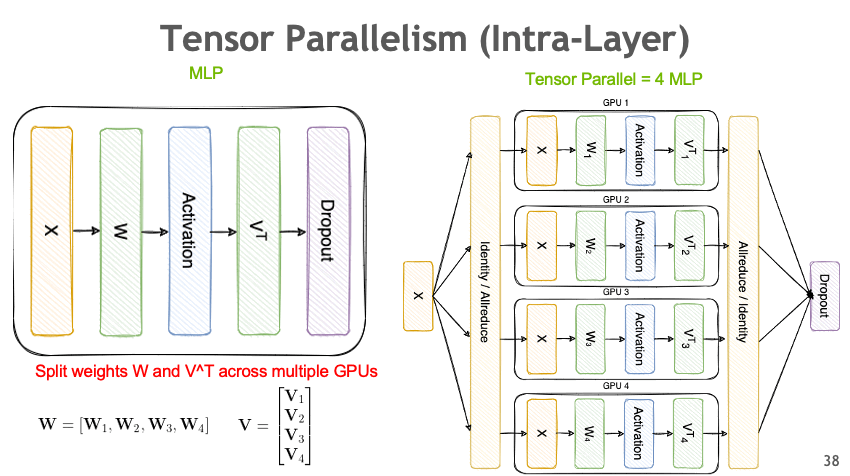
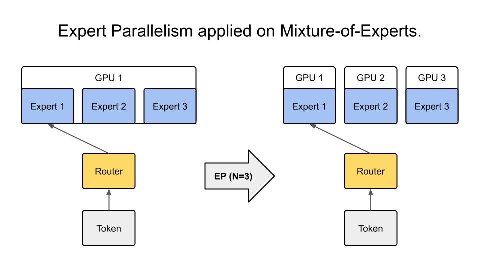

# 并行策略指南

Megatron Bridge 支持多种数据并行和模型并行的深度学习工作负载部署方法，这些方法可以任意组合使用。这些并行策略通过模型提供者类进行配置，并利用 Megatron Core 的实现来获得性能和内存效率。

## 数据并行

数据并行（Data Parallelism, DP）将模型复制到多个 GPU 上。数据批次在 GPU 之间均匀分配，数据并行的 GPU 独立处理它们。虽然计算工作负载有效地分布在 GPU 之间，但需要在训练步骤之间进行 GPU 间通信以保持模型副本的一致性。

### 分布式数据并行

分布式数据并行（Distributed Data Parallelism, DDP）通过在每次参数更新之前跨数据并行 GPU 同步参数梯度来保持模型副本的一致性。更具体地说，它使用全归约（all-reduce）通信集合操作对所有模型副本的梯度进行求和。


*图：分布式数据并行使用全归约操作跨多个 GPU 同步梯度。*

### 分布式优化器

[分布式优化器](https://docs.nvidia.com/megatron-core/developer-guide/latest/user-guide/features/dist_optimizer.html) 是一种内存优化的数据并行部署方法。它将优化器状态和高精度主参数分片到数据并行 GPU 上，而不是复制它们。在参数优化器步骤中，每个数据并行 GPU 更新其参数分片。由于每个 GPU 需要自己的梯度分片，分布式优化器对参数梯度执行归约-分散（reduce-scatter）操作，而不是对它们进行全归约。然后，更新后的参数分片在数据并行 GPU 之间进行全收集（all-gather）。这种方法显著减少了大规模 LLM 训练的内存需求。

### 启用数据并行

在 Megatron Bridge 中，DDP 是默认的并行部署方法。GPU 的总数对应于 DP 组的大小，使用模型并行训练 LLM 会减少 DP 组的大小。

要启用分布式优化器，请配置 {py:class}`bridge.training.config.OptimizerConfig` 和 {py:class}`bridge.training.config.DistributedDataParallelConfig`

```python
from megatron.bridge.training.config import ConfigContainer, DistributedDataParallelConfig, OptimizerConfig

optimizer_config = OptimizerConfig(
    optimizer="adam",
    lr=3e-4,
    weight_decay=0.1,
    adam_beta1=0.9,
    adam_beta2=0.95,
    use_distributed_optimizer=True,
    clip_grad=1.0,
)
ddp_config = DistributedDataParallelConfig(use_distributed_optimizer=True)

config = ConfigContainer(
    ddp=ddp_config,
    optimizer=optimizer_config,
    # ... 其他配置参数
)
```

有关更多优化器选项，请参阅 {py:class}`bridge.training.config.OptimizerConfig` API 文档。

## 模型并行

模型并行（Model Parallelism, MP）是一种分布式模型部署方法，它将模型参数分区到多个 GPU 上，以减少每个 GPU 的内存需求。Megatron Bridge 通过 Megatron Core 支持各种模型并行方法，这些方法可以混合使用以最大化 LLM 训练性能。

### 张量并行

张量并行（Tensor Parallelism, TP）是一种模型并行分区方法，它将单个层的参数张量分布在多个 GPU 上。除了减少模型状态内存使用外，它还节省了激活内存，因为每个 GPU 的张量尺寸缩小了。然而，减少的每个 GPU 张量尺寸由于每个 GPU 内核工作负载较小而增加了 CPU 开销。


*图 1：张量并行将单个层的参数分布在多个 GPU 上。*


*图 2：张量并行如何分割权重矩阵和同步计算的详细视图。*

#### 启用张量并行

要在 Megatron Bridge 中启用 TP，请在模型提供者中配置 `tensor_model_parallel_size` 参数。此参数决定了模型张量被分区到的 GPU 数量。

```python
from megatron.bridge.models import GPTModelProvider
from megatron.bridge.training.config import ConfigContainer

# 配置具有张量并行的模型
model_config = GPTModelProvider(
    tensor_model_parallel_size=2,  # 在 2 个 GPU 上启用 TP
    # ... 其他模型参数
)

config = ConfigContainer(
    model=model_config,
    # ... 其他配置参数
)
```

#### 实现张量并行

Megatron Bridge 通过 Megatron Core 的实现集成了 TP。有关详细的 API 用法和其他配置，请查阅 [Megatron Core 开发者指南](https://docs.nvidia.com/megatron-core/developer-guide/latest/apidocs/core/core.tensor_parallel.html)。

### 管道并行

管道并行（Pipeline Parallelism，PP）是一种将神经网络的连续层或分段分配给不同 GPU 的技术。这种划分允许每个 GPU 顺序处理网络的不同阶段。


*图：管道并行将连续层分布在多个 GPU 上，以流水线方式处理批次。*

#### 启用管道并行

要在 Megatron Bridge 中使用管道并行，请在模型配置中设置 `pipeline_model_parallel_size` 参数。此参数指定模型层分布在其上的 GPU 数量。

```python
from megatron.bridge.models import GPTModelProvider
from megatron.bridge.training.config import ConfigContainer

# 配置具有管道并行的模型
model_config = GPTModelProvider(
    pipeline_model_parallel_size=4,  # 将层分布在 4 个 GPU 上
    # ... 其他模型参数
)

config = ConfigContainer(
    model=model_config,
    # ... 其他配置参数
)
```

#### 交错式管道并行调度

为了最小化管道气泡，每个 GPU 上的计算可以划分为多个层子集（称为模型块），而不是单个连续块。通过设置 `virtual_pipeline_model_parallel_size` 来启用此功能：

```python
model_config = GPTModelProvider(
    pipeline_model_parallel_size=4,
    virtual_pipeline_model_parallel_size=2,  # 每个管道阶段 2 个模型块
    # ... 其他模型参数
)
```

有关此方法的更多见解，请参阅详细博客：[扩展语言模型训练](https://developer.nvidia.com/blog/scaling-language-model-training-to-a-trillion-parameters-using-megatron/#pipeline_parallelism)。

#### 实现管道并行

Megatron Bridge 的 PP 实现利用了 Megatron Core 的功能。有关 PP 的更详细 API 用法和配置，请访问 [Megatron Core 开发者指南](https://docs.nvidia.com/megatron-core/developer-guide/latest/apidocs/core/core.pipeline_parallel.html)。

### 专家并行与专家混合模型

专家并行（Expert Parallelism，EP）是一种模型并行类型，它将专家混合模型（Mixture of Experts，MoE）的专家分布在 GPU 上。与其他模型并行技术不同，EP 仅应用于专家层，不影响其余层的并行映射。

MoE 是一种机器学习技术，其中多个专门模型（专家，通常是多层感知器）被组合起来解决复杂任务。每个专家专注于特定的子任务或领域，而门控网络根据当前输入动态激活最合适的专家。


*图：专家并行将 MoE 专家分布在多个 GPU 上，同时保持其他层被复制。*

#### 基本 MoE 配置

要在 Megatron Bridge 中启用 MoE，请在模型提供程序中配置基本的 MoE 参数：

```python
from megatron.bridge.models import GPTModelProvider

# 配置基本 MoE 模型
model_config = GPTModelProvider(
    num_moe_experts=8,           # MoE 模块中的专家数量
    moe_router_topk=2,           # 每个令牌激活的专家数量
    moe_ffn_hidden_size=8192,    # 专家 FFN 层的隐藏大小
    # ... 其他模型参数
)
```

#### 启用专家并行

要启用 EP，请在模型配置中设置 `expert_model_parallel_size`。例如，如果模型有八个专家（`num_moe_experts=8`），那么设置 `expert_model_parallel_size=4` 将导致每个 GPU 处理两个专家。专家数量应能被专家并行大小整除。

```python
# 配置具有专家并行的 MoE 模型
model_config = GPTModelProvider(
    num_moe_experts=8,
    expert_model_parallel_size=4,  # 将 8 个专家分布在 4 个 GPU 上（每个 GPU 2 个专家）
    # ... 其他模型参数
)
```

#### 启用专家张量并行

要启用专家张量并行（Expert Tensor Parallelism，ETP），请在模型配置中设置 `expert_tensor_parallel_size`：

```python
model_config = GPTModelProvider(
    num_moe_experts=8,
    expert_model_parallel_size=4,
    expert_tensor_parallel_size=2,  # 在每个专家内部应用张量并行
    # ... 其他模型参数
)
```

#### 高级 MoE 功能

Megatron Bridge 为 MoE 模型提供了多种高级优化，以提高在现代 GPU 架构上的性能。

##### DeepEP 和 HybridEP 优化

DeepEP 和 HybridEP 是高性能的 MoE 令牌分发器，可提高特定 GPU 架构上的吞吐量和效率：

- **DeepEP**：针对 Ampere、Hopper、B200 和 B300 GPU 进行了优化
- **HybridEP**：针对配备 NVL72 的 GB200、GB300 以及 Ampere、Hopper、B200、B300 GPU 进行了优化

这些分发器用优化的“flex”分发器取代了标准的令牌路由机制，为 MoE 工作负载提供了更好的性能。

**启用 DeepEP：**

```python

from megatron.bridge.models import GPTModelProvider
from megatron.bridge.training.flex_dispatcher_backend import apply_flex_dispatcher_backend

model_config = GPTModelProvider(
    num_moe_experts=8,
    expert_model_parallel_size=4,
    # ... 其他模型参数
)

# 应用 DeepEP 优化
apply_flex_dispatcher_backend(model_config, moe_flex_dispatcher_backend="deepep")
```

**启用 HybridEP：**

```python
from megatron.bridge.models import GPTModelProvider
from megatron.bridge.training.flex_dispatcher_backend import apply_flex_dispatcher_backend

model_config = GPTModelProvider(
    num_moe_experts=8,
    expert_model_parallel_size=4,
    # ... 其他模型参数
)

# 应用 HybridEP 优化
apply_flex_dispatcher_backend(model_config, moe_flex_dispatcher_backend="hybridep")
```

**GPU 架构要求：**

- **DeepEP**: Ampere (SM 8.x), Hopper (SM 9.x), B200, B300
- **HybridEP**: GB200, GB300 with NVL72, Ampere (SM 8.x), Hopper (SM 9.x), B200, B300

系统会自动验证 GPU 兼容性，如果当前硬件不支持该调度器，则会发出警告。

##### 用于负载均衡的令牌丢弃

令牌丢弃通过容量因子平衡专家间的工作负载，从而提升 MoE 性能。此功能允许模型在专家过载时丢弃令牌，防止掉队者问题并提高整体吞吐量。

```python
from megatron.bridge.models import GPTModelProvider
from megatron.bridge.training.utils.moe_token_drop import apply_moe_token_drop

model_config = GPTModelProvider(
    num_moe_experts=8,
    moe_router_topk=2,
    moe_token_dispatcher_type="alltoall",  # 令牌丢弃所需
    moe_router_load_balancing_type="aux_loss",  # 所需的负载均衡类型
    # ... 其他模型参数
)

# 应用带容量因子的令牌丢弃
apply_moe_token_drop(
    model_config,
    moe_expert_capacity_factor=1.0,  # 每个专家的容量乘数
    moe_pad_expert_input_to_capacity=True,  # 将输入填充至容量长度
)
```

**配置参数：**

- `moe_expert_capacity_factor`：控制每个专家可以处理的最大令牌数。因子为 1.0 意味着每个专家恰好可以处理其按比例分配的令牌份额。较低的值（例如 0.8）会丢弃更多令牌，但能改善负载均衡。
- `moe_pad_expert_input_to_capacity`：启用时，将专家输入填充至容量长度，以保持一致的批次大小。

**要求：**

- 令牌调度器必须为 `alltoall` 或 `alltoall_seq`
- 负载均衡类型必须为 `aux_loss`、`seq_aux_loss` 或 `none`

**权衡：**

在不平衡的 MoE 模型中，令牌丢弃可以将训练吞吐量提高 10-30%，但如果过于激进可能会影响收敛。建议从容量因子 1.0 开始，并根据需要逐步降低。

#### 完整的 MoE 配置示例

以下是一个完整的示例，展示如何配置一个带有高级优化的 MoE 模型：

```python
from megatron.bridge.models import GPTModelProvider
from megatron.bridge.training.config import ConfigContainer
from megatron.bridge.training.flex_dispatcher_backend import apply_flex_dispatcher_backend
from megatron.bridge.training.utils.moe_token_drop import apply_moe_token_drop

# 配置带有专家并行的 MoE 模型
model_config = GPTModelProvider(
    num_layers=32,
    hidden_size=4096,
    num_attention_heads=32,
    
    # MoE 配置
    num_moe_experts=8,                    # 总共 8 个专家
    moe_router_topk=2,                    # 每个令牌激活 2 个专家
    moe_ffn_hidden_size=8192,            # 专家 FFN 隐藏维度
    moe_token_dispatcher_type="alltoall", # 令牌调度器类型
    moe_router_load_balancing_type="aux_loss",  # 负载均衡
    
    # 专家并行
    expert_model_parallel_size=4,         # 在 4 个 GPU 上分布专家
    expert_tensor_parallel_size=2,        # 在每个专家内部应用 TP
    
    # ... 其他模型参数
)

# 应用 DeepEP 优化（适用于 Ampere/Hopper GPU）
apply_flex_dispatcher_backend(model_config, moe_flex_dispatcher_backend="deepep")

# 应用令牌丢弃以进行负载均衡
apply_moe_token_drop(
    model_config,
    moe_expert_capacity_factor=1.0,
    moe_pad_expert_input_to_capacity=True,
)

config = ConfigContainer(
    model=model_config,
    # ... 其他配置参数
)
```

#### 专家并行实现

Megatron Bridge 的 EP 实现使用了 Megatron Core 的功能。更多 MoE 实现细节，请参阅 [Megatron Core MoE 层](https://github.com/NVIDIA/Megatron-LM/blob/main/megatron/core/transformer/moe/moe_layer.py#L42)。

## 激活分区

在 LLM 训练中，需要大量内存空间来存储网络层的输入激活。Megatron Bridge 通过 Megatron Core 提供了有效的激活分布方法，这对于训练具有长序列长度或大单 GPU 微批次大小的 LLM 至关重要。

### 序列并行

序列并行（Sequence Parallelism，SP）通过沿 Transformer 层的序列维度在多个 GPU 之间分配计算负载和激活内存，扩展了张量级模型并行。这种方法对于之前尚未并行化的层部分特别有用，可提升整体模型性能和效率。


*图：序列并行将序列维度分布在多个 GPU 上，减少了激活内存。*

#### 启用序列并行

要在 Megatron Bridge 中使用 SP，请在模型配置中将 `sequence_parallel` 参数设置为 `True`。请注意，此功能仅在张量并行大小（`tensor_model_parallel_size`）大于 `1` 时有效。

```python
from megatron.bridge.models import GPTModelProvider

# 配置启用序列并行的模型
model_config = GPTModelProvider(
    tensor_model_parallel_size=2,  # 序列并行的必要条件
    sequence_parallel=True,        # 启用序列并行
    # ... 其他模型参数
)
```

#### 实现序列并行

Megatron Bridge 中的 SP 实现利用了 Megatron Core 的功能。要深入了解序列并行如何集成到 Megatron Core 架构中，您可以查看源代码：[Megatron-LM 序列并行源代码](https://github.com/NVIDIA/Megatron-LM/blob/main/megatron/core/tensor_parallel/layers.py)。

### 上下文并行

上下文并行（Context Parallelism，CP）是一种通过沿序列维度划分输入张量，在多个 GPU 上并行处理神经网络激活的方法。与划分特定层激活的序列并行（SP）不同，CP 划分所有层的激活。

CP 对于训练长上下文模型至关重要，因为它允许模型通过将序列激活分布在多个 GPU 上来处理更长的序列。这种方法减少了处理长序列时的内存占用和计算成本。

#### 启用上下文并行

要在 Megatron Bridge 中激活 CP，请在模型配置中设置 `context_parallel_size` 参数。此参数指定模型序列激活分布所跨的 GPU 数量。

```python
from megatron.bridge.models import GPTModelProvider

# 配置启用上下文并行的模型
model_config = GPTModelProvider(
    context_parallel_size=2,  # 在 2 个 GPU 上分布序列
    # ... 其他模型参数
)
```

对于长上下文训练场景，上下文并行特别有效，并且对于处理超出单个 GPU 内存容量的序列至关重要。

#### 实现上下文并行

Megatron Bridge 利用 Megatron Core 和 Transformer Engine 的功能来高效实现 CP。在前向传播期间，每个 GPU 处理序列的一个片段，仅存储必要的键值（KV）对。在反向传播过程中，这些 KV 对通过使用高级通信方案（如 all-gather 和 reduce-scatter，在环形拓扑中转换为点对点通信）在 GPU 之间重新组装。这种方法在保持计算效率的同时，显著减少了内存占用。

有关更详细的技术信息和实现细节，请访问：
- [Megatron Core 上下文并行文档](https://docs.nvidia.com/megatron-core/developer-guide/latest/user-guide/features/context_parallel.html)
- [Megatron Core 对 Transformer Engine 的封装](https://github.com/NVIDIA/Megatron-LM/blob/main/megatron/core/transformer/custom_layers/transformer_engine.py)
- [Transformer Engine 注意力模块](https://github.com/NVIDIA/TransformerEngine/blob/main/transformer_engine/pytorch/attention.py)

## 组合并行示例

Megatron Bridge 允许您组合多种并行策略，以实现最佳性能和内存效率：

```python
from megatron.bridge.models import GPTModelProvider
from megatron.bridge.training.config import ConfigContainer, OptimizerConfig

# 配置使用多种并行策略的模型
model_config = GPTModelProvider(
    # 模型并行
    tensor_model_parallel_size=2,      # 2 路张量并行
    pipeline_model_parallel_size=4,    # 4 路管道并行
    virtual_pipeline_model_parallel_size=2,  # 交错式管道

    # 激活分区
    sequence_parallel=True,            # 启用序列并行（要求 TP > 1）
    context_parallel_size=2,           # 2 路上下文并行

    # 专家并行（用于 MoE 模型）
    num_moe_experts=8,                 # 8 个专家
    expert_model_parallel_size=4,      # 在 4 个 GPU 上分布专家

    # ... 其他模型参数
)

# 配置分布式优化器
optimizer_config = OptimizerConfig(
    optimizer="adam",
```

use_distributed_optimizer=True,    # 启用分布式优化器
    # ... 其他优化器参数
)

config = ConfigContainer(
    model=model_config,
    optimizer=optimizer_config,
    # ... 其他配置参数
)
```

## 数据并行大小计算

数据并行大小会根据总的世界大小（world size）和模型并行设置自动计算：

```
data_parallel_size = world_size / (tensor_model_parallel_size × pipeline_model_parallel_size × context_parallel_size)
```

例如，总共有 32 个 GPU，使用上述配置：
- `tensor_model_parallel_size = 2`
- `pipeline_model_parallel_size = 4`
- `context_parallel_size = 2`
- `data_parallel_size = 32 / (2 × 4 × 2) = 2`

## 策略选择指南

选择合适的组合取决于模型大小、硬件拓扑和序列长度。

### 按大小划分的稠密模型

| 模型大小 | GPU 数量 | 推荐的起始点 |
|---|---|---|
| < 1B | 1-8 | 仅使用 DP |
| 1-10B | 8-16 | TP=2-4 + DP |
| 10-70B | 16-64 | TP=4-8 + PP=2-4 + DP |
| 70-175B | 64-256 | TP=8 + PP=4-8 + DP |
| 175-500B | 256-1024 | TP=8 + PP=8-16 + CP=2 + DP |

### MoE 模型

MoE 模型与稠密模型有根本区别：每个 token 只激活一小部分参数，因此 TP 通常可以保持在 1 或 2。EP 是主要的扩展维度。

| 总参数 / 激活参数 | 典型布局 |
|---|---|
| < 20B | 仅 EP (TP=1, PP=1) |
| 20-100B | TP=1-2 + PP=2-4 + EP=8-16 |
| 100-500B | TP=2-4 + PP=8-16 + EP=8-32 |
| 500B+ | TP=2 + PP=16 + EP=32-64 |

### 按硬件拓扑

- **具有 NVLink 的单节点**：在节点内最大化 TP（最高可达 TP=8）。
- **具有 InfiniBand 的多节点**：将 TP 保持在节点内，跨节点使用 PP。
- **有限网络（以太网）**：最小化 TP，跨节点扩展时优先使用 PP。

### 按序列长度

| 序列长度 | 建议 |
|---|---|
| < 2K | 标准 TP + PP + DP |
| 2K-8K | 添加 SP (`sequence_parallel=True`) |
| 8K-32K | 添加 CP=2 |
| 32K+ | 添加 CP=4-8，考虑分层 CP |

有关配置组合并行、故障排除布局和内存估算的操作细节，请参阅 [并行策略技能](skills/perf-techniques/parallelism-strategies/SKILL.md)。

## 配置指南

### 内存优化
- 使用**分布式优化器**以减少优化器状态内存
- 使用张量并行时启用**序列并行**以减少激活内存
- 长序列训练时使用**上下文并行**
- 对于无法放入单个 GPU 的超大模型，考虑使用**管道并行**

### 性能优化
- **张量并行**在单个节点内（高带宽）效果最佳
- **管道并行**可以跨节点工作，但需要仔细调整批次大小
- **上下文并行**对于长上下文场景至关重要
- **专家并行**专用于 MoE 模型，应与专家数量匹配
- **DeepEP/HybridEP** 在支持的 GPU 架构上提供优化的 MoE token 分发

### 兼容性
- **序列并行**要求 `tensor_model_parallel_size > 1`
- **专家并行**要求 MoE 模型 (`num_moe_experts > 0`)
- **DeepEP** 需要 Ampere、Hopper、B200 或 B300 GPU
- **HybridEP** 需要 GB200、GB300 with NVL72，或 Ampere、Hopper、B200、B300 GPU
- **Token dropping** 需要 `alltoall` 或 `alltoall_seq` token 分发器
- 所有并行策略都可以组合使用，但总并行度必须能被世界大小整除

## 相关制品

- **操作技能**：[skills/perf-techniques/parallelism-strategies/SKILL.md](skills/perf-techniques/parallelism-strategies/SKILL.md) — 启用、陷阱、内存估算、验证
- **知识卡片**：[skills/perf-techniques/parallelism-strategies/card.yaml](skills/perf-techniques/parallelism-strategies/card.yaml) — 结构化元数据和验证状态

## 资源

- [Megatron Core 开发者指南](https://docs.nvidia.com/megatron-core/developer-guide/latest/)
- [扩展语言模型训练](https://developer.nvidia.com/blog/scaling-language-model-training-to-a-trillion-parameters-using-megatron/)
- [Megatron-LM 仓库](https://github.com/NVIDIA/Megatron-LM)
- [Transformer Engine](https://github.com/NVIDIA/TransformerEngine)