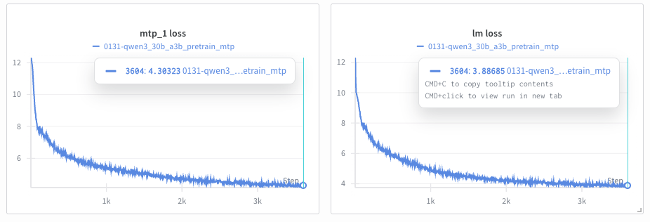
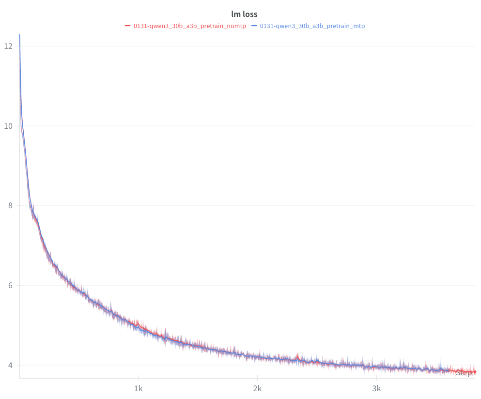

# 多令牌预测（MTP）

## 概述

多令牌预测（MTP）是一种先进的训练技术，由 [DeepSeek-V3 技术报告](https://arxiv.org/abs/2412.19437) 提出，它使模型能够在预训练期间同时预测多个未来的令牌。MTP 不是仅学习预测每个位置的下一个令牌，而是添加了辅助预测头，用于预测 2、3 或更多个位置之后的令牌。

### 主要优势

- **密集化的训练信号**：每次训练迭代产生多个学习信号，提高了数据效率
- **预规划表示**：模型学习编码未来令牌信息的内部表示
- **推测解码基础**：经过 MTP 训练的模型可以作为通过推测解码实现更快推理的基础

### 何时使用 MTP

MTP 在以下场景中最为有益：

- **大规模预训练**（模型参数 > 100 亿）
- **数据受限的场景**，其中最大化有限数据的学习至关重要
- **训练基础模型**，用于下游微调或推测解码

MTP 主要用于预训练。

### 其他资源

- [DeepSeek-V3 技术报告](https://arxiv.org/abs/2412.19437) - 介绍 MTP 的原始论文
- [DeepSeek-V3 GitHub](https://github.com/deepseek-ai/DeepSeek-V3) - 官方实现
- [Megatron Core MTP 指南](https://github.com/NVIDIA/Megatron-LM/blob/main/docs/user-guide/features/multi_token_prediction.md) - 底层实现细节

## 配置参数

MTP 由两个主要参数控制：

| 参数 | 类型 | 默认值 | 描述 | 典型范围 |
|-----------|------|---------|-------------|---------------|
| `mtp_num_layers` | int | `None` (禁用) | 辅助预测的深度层数。每层预测 N 个位置之后的令牌（N=1,2,...,mtp_num_layers）。 | 1-2 |
| `mtp_loss_scaling_factor` | float | `0.1` | 应用于 MTP 损失相对于主下一个令牌损失的权重。控制辅助预测对总损失的贡献。 | 0.05-0.2 |

### 损失计算

总训练损失结合了主下一个令牌预测损失和平均 MTP 损失：

```
total_loss = main_loss + (avg_mtp_loss * mtp_loss_scaling_factor)

其中：
  avg_mtp_loss = mean([mtp_1_loss, mtp_2_loss, ..., mtp_N_loss])
```

### 参数调优指南

**`mtp_num_layers`:**
- 对于大多数模型，从 `1` 开始（预测 1 个令牌之后）
- 如果内存允许，对于参数 > 1000 亿的模型使用 `2`
- 更高的值会按比例增加内存使用和训练时间

**`mtp_loss_scaling_factor`:**
- 默认值 `0.1` 对大多数模型效果良好
- 如果 MTP 损失没有下降，增加到 `0.15-0.2`
- 如果主损失被掩盖，减少到 `0.05-0.08`
- 缩放因子应与 `mtp_num_layers` 成比例（更多层 → 更低的因子）

## 基本用法：从头开始训练

### 最小配置示例

这是一个使用启用了 MTP 的 Qwen3 30B-A3B 配方的最小示例：

```python
from megatron.bridge.recipes.qwen.qwen3_moe import qwen3_30b_a3b_pretrain_config
from megatron.bridge.training.pretrain import pretrain
from megatron.bridge.training.gpt_step import forward_step
from megatron.bridge.training.config import ConfigContainer

log_dir = "/path/to/log/dir"
cfg: ConfigContainer = qwen3_30b_a3b_pretrain_config()
cfg.logger.tensorboard_dir = log_dir + "/tb_logs"
cfg.checkpoint.save = log_dir + "/checkpoints"
cfg.checkpoint.load = log_dir + "/checkpoints"
# 设置训练数据集
cfg.dataset.blend=[[
    f"/path/to/dclm/preprocessed/dclm_{i:02d}_text_document"
    for i in range(1, 11)
], None]
cfg.dataset.split="9999,8,2"
cfg.dataset.path_to_cache = "/path/to/cache"
# cfg.model.num_layers = 8  # 如果内存不足，训练一个较小的模型
# MTP 配置
cfg.model.mtp_num_layers = 1
cfg.model.mtp_loss_scaling_factor = 0.1
pretrain(cfg, forward_step)
```
按照 [DCLM 教程](https://github.com/NVIDIA-NeMo/Megatron-Bridge/tree/main/tutorials/data/dclm) 准备训练数据


## 结合管道并行使用 MTP

当使用管道并行（PP）时，**MTP 层必须与损失计算层一起放置在最后一个管道阶段**。使用自定义管道布局设置（`pipeline_model_parallel_split_rank`）来配置此设置。

### 管道布局指南

MTP 层的训练时间大约与常规 Transformer 层相同。配置管道布局时：

- **将 MTP 放在最后一个 PP 阶段**（这是正确计算损失所必需的）
- **减少其他 PP 秩中的层数**，以平衡各阶段的计算时间
- 示例：对于一个 21 层的模型，PP=4 且 `mtp_num_layers=1`，你可以使用像 `[5, 6, 6, 4]` 这样的分割，而不是 `[5, 5, 5, 6]`，以考虑最后一个阶段中 MTP 的开销


## 并行性支持

MTP 与 Megatron-Bridge 中的所有主要并行策略兼容：

| 并行类型 | 支持状态 | 备注 |
|------------------|----------------|-------|

| **张量并行（TP）** | ✅ 完全支持 | MTP 层自动在 TP 等级间分片 |
| **管道并行（PP）** | ✅ 有条件支持 | MTP 必须在最后一个管道阶段（见上文） |
| **专家并行（EP）** | ✅ 完全支持 | 适用于 MoE 模型（DeepSeek-V3、Mixtral 等） |
| **上下文并行（CP）** | ✅ 完全支持 | MTP 通过 CP 支持长上下文训练 |
| **数据并行（DP）** | ✅ 完全支持 | 标准数据并行透明工作 |

## 监控 MTP 训练

### 逐层损失记录

训练期间，您将看到每个 MTP 深度的损失被单独记录：

```
iteration      100/  300000 | consumed samples:         3200 | elapsed time per iteration (ms): 3738.6 | learning rate: 6.000000E-05 | global batch size:    32 | lm loss: 7.968678E+00 | load_balancing_loss: 1.329517E+00 | mtp_1 loss: 7.925096E+00 | loss scale: 1.0 | grad norm: 1.040 | number of skipped iterations:   0 | number of nan iterations:   0 |
```

### 解读损失值



上图显示了启用 MTP 训练的典型训练曲线：
- **左图**：MTP 辅助损失（`mtp_1 loss`），跟踪第一个额外令牌的预测
- **右图**：标准下一令牌预测的主语言模型损失（`lm loss`）

**预期模式：**

- **MTP 损失高于主损失**：预测更远的未来令牌本质上更难。在上例中，`mtp_1 loss`（约 4.3）在 3500 次迭代时高于 `lm loss`（约 3.9）。
- **所有损失随训练下降**：主损失和 MTP 损失都应呈下降趋势，如上图曲线所示。
- **损失差距保持相对稳定**：主损失和 MTP 损失之间的差异不应在训练过程中显著增大。

**危险信号：**

- **NaN 值**：表明训练不稳定（见故障排除部分）
- **损失发散**：如果 MTP 损失增加而主损失减少，请降低 `mtp_loss_scaling_factor`
- **差距扩大**：如果 MTP 损失落后超过 1.0，请增加 `mtp_loss_scaling_factor`

**MTP 与非 MTP 对比：**



上图比较了 Qwen3-30B-A3B 上启用 MTP（蓝色）和未启用 MTP（红色）训练运行的 `lm loss`。在前几千次迭代中，曲线没有显著差异。值得注意的是，启用 MTP 的运行在迭代 1000 和 2300 附近表现出更平滑的行为，而未启用 MTP 的运行则显示出更明显的尖峰。

### TensorBoard/WandB 可视化

MTP 损失会自动记录到 TensorBoard 和/或 WandB。请查找：

- `lm loss` - 主下一令牌预测损失
- `mtp_1 loss` - 第一个辅助预测损失
- `mtp_2 loss` - 第二个辅助预测损失（如果 `mtp_num_layers=2`）

### 训练特性

- MTP 由于额外的前向传递而增加了计算开销
- 内存使用量随 `mtp_num_layers` 成比例增加
- MTP 旨在提高预训练期间的数据效率

**模型性能：**

- MTP 在每个令牌位置提供额外的训练信号
- 可能提高下游任务性能
- MTP 训练的模型可在推理时用于推测解码

## 当前限制

以下功能目前尚不支持 MTP：

| 功能 | 状态 | 解决方法 |
|---------|--------|------------|
| **HuggingFace ↔ Megatron 检查点转换** | ⚠️ 模型特定 | 转换支持因模型而异；请查阅特定模型的文档 |
| **序列打包（微调）** | ❌ 不支持 | 对于预训练，没有问题。对于微调，设置 `packed_sequence_specs=None` |
| **交叉注意力** | ❌ 不支持 | MTP 仅适用于仅解码器模型（GPT、Llama 等） |
| **学习的绝对位置嵌入** | ❌ 不支持 | 使用 RoPE（旋转位置嵌入）或无位置嵌入 |
| **基于块的激活重计算** | ❌ 不支持 | 使用 `recompute_granularity="selective"` 或 `"uniform"` |

### 重要说明

**检查点转换：**

使用 MTP 进行 HuggingFace ↔ Megatron 检查点转换是模型特定的。一些模型计划支持转换，而其他模型可能不支持 MTP 参数映射。请查阅您特定模型的文档。

**序列打包：**

MTP 与微调序列打包（例如，使用打包序列的 SFT）不兼容。对于预训练，没有序列打包限制。

## 故障排除指南

### 错误：内存不足（OOM）

MTP 会按 `mtp_num_layers` 成比例增加内存使用量。请尝试：
- 将 `mtp_num_layers` 减少到 1
- 启用激活重计算：`recompute_granularity="selective"`
- 增加管道并行度
- 减少微批次大小

### 错误：MTP 损失为 NaN

训练不稳定。请尝试：
- 降低学习率
- 启用梯度裁剪：`clip_grad=1.0`
- 使用 BF16 代替 FP16
- 将 `mtp_loss_scaling_factor` 降低到 0.05

### 预期日志：`MTP layers not found on this PP rank`

这是正常现象。只有最后一个流水线阶段会构建 MTP 层。

## 附加资源

### 代码示例

- **DeepSeek-V3 配方**：[`src/megatron/bridge/recipes/deepseek/deepseek_v3.py`](../../src/megatron/bridge/recipes/deepseek/deepseek_v3.py)
  - 大规模 MoE 模型使用 MTP 的示例
  - PP + MTP 的预定义流水线布局

- **Qwen3-Next 配方**：[`src/megatron/bridge/recipes/qwen/qwen3_next.py`](../../src/megatron/bridge/recipes/qwen/qwen3_next.py)
  - 密集模型 MTP 配置的清晰示例
  - 自定义配方的良好起点

- **MTP 核心实现**：[`3rdparty/Megatron-LM/megatron/core/transformer/multi_token_prediction.py`](../../3rdparty/Megatron-LM/megatron/core/transformer/multi_token_prediction.py)
  - 底层 MTP 层实现
  - 损失计算和日志记录辅助工具

### 文档

- **Megatron Core MTP 指南**：[`3rdparty/Megatron-LM/docs/user-guide/features/multi_token_prediction.md`](https://github.com/NVIDIA/Megatron-LM/blob/main/docs/user-guide/features/multi_token_prediction.md)
  - 实现说明和设计决策

- **流水线并行指南**：[`docs/parallelisms.md`](../parallelisms.md)
  - 理解流水线并行布局
  - PP 配置的最佳实践

### 外部资源

- **DeepSeek-V3 技术报告**：[https://arxiv.org/abs/2412.19437](https://arxiv.org/abs/2412.19437)
  - 介绍 MTP 的原始论文
  - 第 3.2 节："多令牌预测"
  - 训练细节和消融研究

- **DeepSeek-V3 GitHub**：[https://github.com/deepseek-ai/DeepSeek-V3](https://github.com/deepseek-ai/DeepSeek-V3)
  - 官方实现和模型权重
  - 训练配置和超参数

- **Megatron-LM GitHub**：[https://github.com/NVIDIA/Megatron-LM](https://github.com/NVIDIA/Megatron-LM)
  - 上游 Megatron-Core 实现
  - 问题与讨论

### 获取帮助

如果您遇到本指南未涵盖的问题：

1. 查看 [Megatron-Bridge GitHub Issues](https://github.com/NVIDIA-NeMo/Megatron-Bridge/issues)
2. 查阅 [Megatron-LM Discussions](https://github.com/NVIDIA/Megatron-LM/discussions)

报告问题时，请包含：
- 完整的训练配置（配方和参数）
- 错误信息和堆栈跟踪
- GPU 类型和数量
- Megatron-Core 版本 (`pip show megatron-core`)